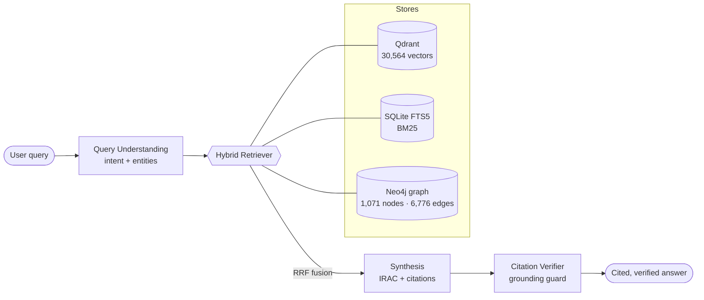
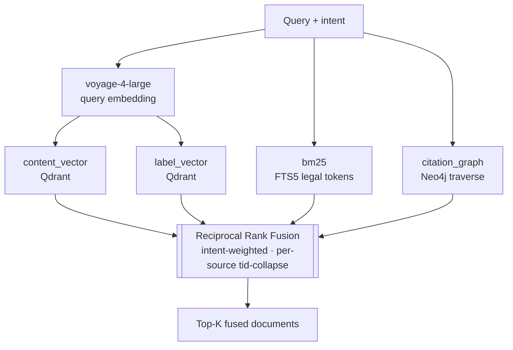
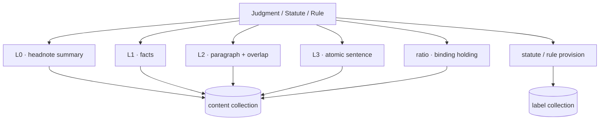
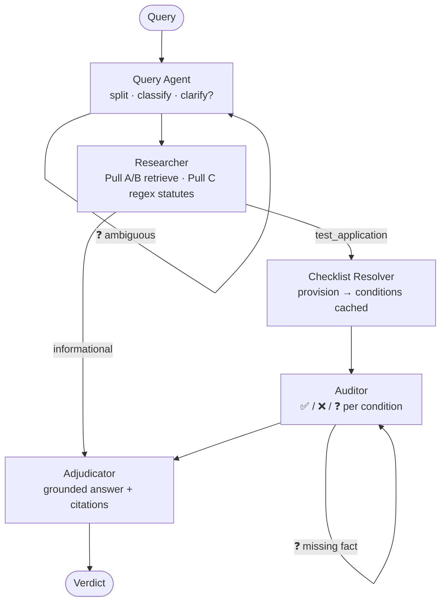
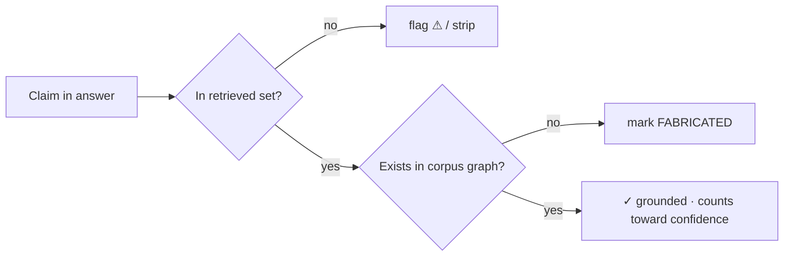

# JurisNet Deck — Diagrams & Images

Two kinds of visuals. **Diagrams with text** → build from the Mermaid specs below (paste into
[mermaid.live](https://mermaid.live) → export SVG/PNG → drop into Canva). **Never** generate
flowcharts with an AI image tool — it garbles the text. **Illustrative imagery** (hero, section
dividers, motifs) → use the text-free image-gen prompts at the bottom.

Theme for everything: minimal monochrome (near-black on white) + a single accent (indigo `#4f46e5`).

---

## Diagram A — End-to-end architecture (Slide 4)

## Diagram B — 4-source hybrid retrieval → RRF (Slide 7)

## Diagram C — Legal-aware multi-level chunking (Slide 6)

## Diagram D — Agentic pipeline with the ❓ loop (Slide 9) — mirrors agents/graph.py

## Diagram E — "No guessing ahead of evidence" grounding loop (Slide 10)

## Comparison matrix (Slide 13) — build as a Canva TABLE (not an image)
| Capability | Vanilla RAG | GraphRAG | Agentic RAG | **JurisNet** |
|---|---|---|---|---|
| Dense retrieval | ✓ | ✓ | ✓ | ✓ |
| Keyword/BM25 fusion | ✗ | ~ | ~ | ✓ |
| Knowledge graph | ✗ | ✓ | ~ | ✓ (citation graph) |
| Domain-aware chunking | ✗ | ✗ | ~ | ✓ (L0–L3 + ratio) |
| Reasoning over statutory conditions | ✗ | ✗ | ~ | ✓ (checklist + audit) |
| Human-in-the-loop ❓ for missing facts | ✗ | ✗ | ~ | ✓ |
| Citation verification (anti-hallucination) | ✗ | ✗ | ~ | ✓ (verifier) |
| Production resilience (key rotation/cache) | ✗ | ✗ | ~ | ✓ |

(✓ = yes · ~ = partial/varies · ✗ = no)

---

## Illustrative image-gen prompts (text-free; Midjourney / DALL·E / Canva)
- **Hero (Slide 1):** "Minimalist editorial illustration of justice scales dissolving into a glowing network of connected nodes, near-black on off-white, single indigo accent, generous negative space, premium legal-tech aesthetic, no text."
- **Section divider:** "Abstract knowledge-graph constellation of small nodes and thin edges, monochrome with one indigo accent line, lots of whitespace, minimal, no text."
- **Problem slide motif (Slide 2/3):** "A single document fragment fracturing into scattered question marks, muted monochrome, one indigo accent, conceptual, clean, no text."
- **Production/scale motif (Slide 14):** "Abstract resilient pipeline of rotating interlocking rings suggesting failover and load balancing, monochrome + indigo accent, minimal, no text."
